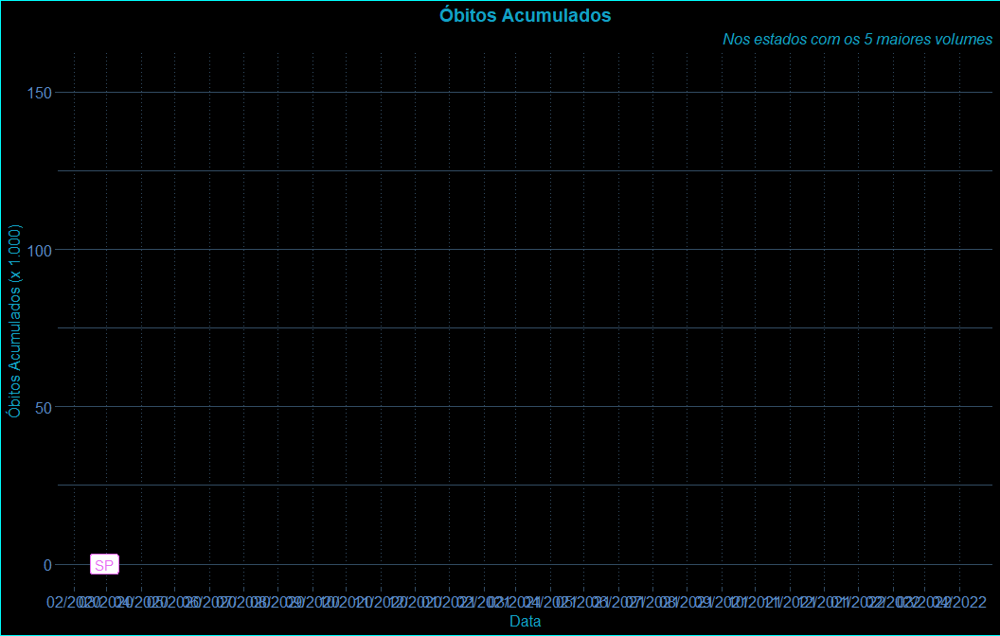
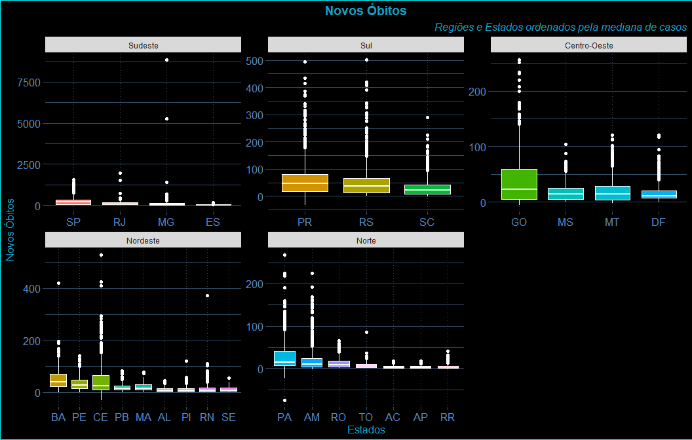
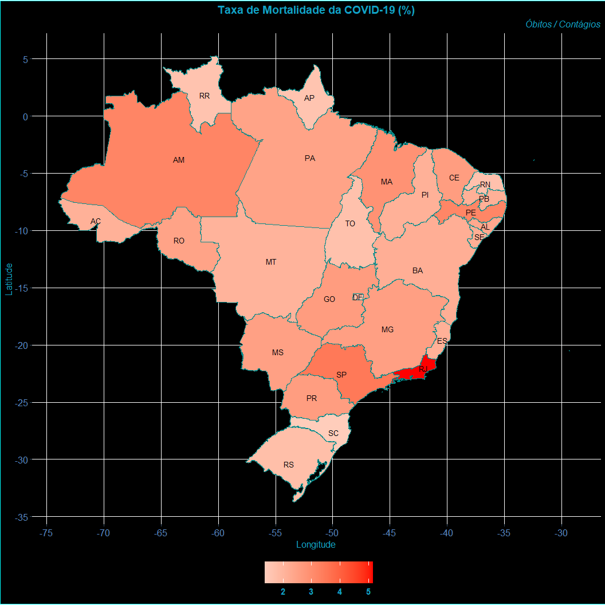
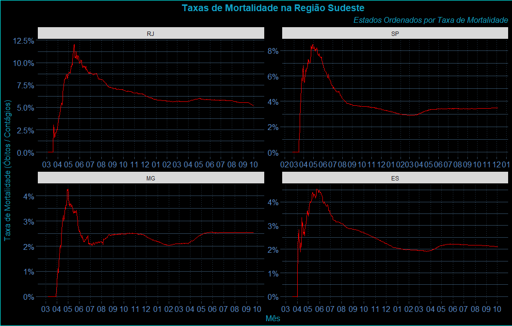
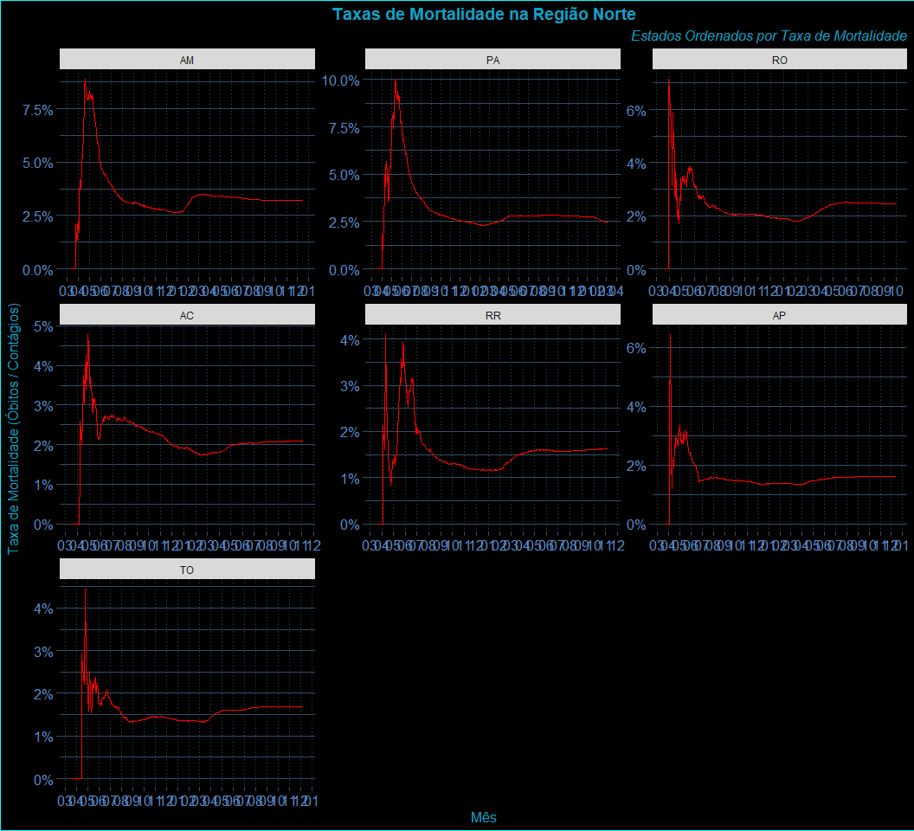

<!-- README.md is generated from README.Rmd. Please edit that file -->

# AnaliseCOVID19Brasil

<!-- badges: start -->

<!-- badges: end -->

O objetivo do pacote AnaliseCOVID19Brasil é o de prover análises
práticas e atualizadas, incluindo alguns gráficos, além de ser o meu
trabalho de conclusão do curso R para Ciência de Dados 2 da
[Curso-R](https://www.curso-r.com/).

Aí você pode se perguntar…

Se tantos pacotes já fazem análises de dados da COVID-19, por que usar
este aqui ~~e não algum outro~~?

Meu primeiro enfoque foi o de fazer um pacote que permita, *de maneira
muito simples*, **atualizar** os dados da pandemia no Brasil **antes**
de proceder às análises. Em outras palavras, toda a dinâmica da pandemia
no Brasil vai se revelando conforme este pacote é utilizado ao longo do
tempo.

-----

## Instalação

Você pode instalar o AnaliseCOVID19Brasil do
[GitHub](https://github.com/) com:

``` r
# install.packages("devtools")
devtools::install_github("brunocp76/AnaliseCOVID19Brasil")
```

## Utilização - Atualização de Dados

Como disse, os primeiros propósitos deste pacotes são ser simples do
usuário utilizar e poder atualizar os dados antes de proceder à
qualquer análise. Então começamos assim:

``` r
library(AnaliseCOVID19Brasil)

atualiza_dados()
#> 
#> Atualizacao de dados iniciada em 2020-09-22 20:49:35
#> 
#> Etapa 1: Carregando dados do Portal Brasil.io.
#> 
#> Por favor aguarde...
#> Parsed with column specification:
#> cols(
#>   date = col_date(format = ""),
#>   state = col_character(),
#>   city = col_character(),
#>   place_type = col_character(),
#>   confirmed = col_double(),
#>   deaths = col_double(),
#>   order_for_place = col_double(),
#>   is_last = col_logical(),
#>   estimated_population_2019 = col_double(),
#>   city_ibge_code = col_double(),
#>   confirmed_per_100k_inhabitants = col_double(),
#>   death_rate = col_double()
#> )
#> 
#> Concluida a importacao de dados do Portal Brasil.io em 14.39 segundos.
#> 
#> 
#> 
#> Etapa 2: Carregando dados do Ministerio da Saude.
#> 
#> Por favor aguarde mais um pouco...
#> 
#> 
#> Concluida a importacao de dados do Ministerio da Saude em 63.88 segundos.
#> 
#> 
#> 
#> Etapa 3: Carregando Informacoes Auxiliares.
#> 
#> 
#> Concluida a carga de Informacoes Auxiliares em 1.45 segundos.
#> 
#> 
#> 
#> Etapa 4: Organizando todas as informacoes levantadas.
#> 
#> 
#> Concluida a organizacao de todas as informacoes levantadas em 3.46 segundos.
#> 
#> 
#> 
#> Parabens! Agora voce esta com a base atualizada!
#> 
#> O processamento foi concluido em 83.18 segundos.
#> 
#> Segue um resumo da base:
#> 
#> Rows: 1,003,500
#> Columns: 18
#> $ date                 <date> 2020-03-27, 2020-03-28, 2020-03-29, 2020-03-3...
#> $ semana_epidem        <int> 13, 13, 14, 14, 14, 14, 14, 14, 14, 15, 15, 15...
#> $ cod_ibge             <int> 1100015, 1100015, 1100015, 1100015, 1100015, 1...
#> $ lat                  <dbl> -11.9283, -11.9283, -11.9283, -11.9283, -11.92...
#> $ lon                  <dbl> -61.9953, -61.9953, -61.9953, -61.9953, -61.99...
#> $ area_km2             <dbl> 7067.025, 7067.025, 7067.025, 7067.025, 7067.0...
#> $ capital              <int> 0, 0, 0, 0, 0, 0, 0, 0, 0, 0, 0, 0, 0, 0, 0, 0...
#> $ interior_metropol    <int> 0, 0, 0, 0, 0, 0, 0, 0, 0, 0, 0, 0, 0, 0, 0, 0...
#> $ pop_2019             <int> 22945, 22945, 22945, 22945, 22945, 22945, 2294...
#> $ municipio            <chr> "Alta Floresta D'Oeste", "Alta Floresta D'Oest...
#> $ cod_regiao_saude     <int> 11005, 11005, 11005, 11005, 11005, 11005, 1100...
#> $ nome_regiao_saude    <chr> "Zona da Mata", "Zona da Mata", "Zona da Mata"...
#> $ uf                   <chr> "RO", "RO", "RO", "RO", "RO", "RO", "RO", "RO"...
#> $ regiao               <chr> "Norte", "Norte", "Norte", "Norte", "Norte", "...
#> $ contagios_novos      <int> 0, 0, 0, 0, 0, 0, 0, 0, 0, 0, 0, 0, 0, 0, 0, 0...
#> $ obitos_novos         <int> 0, 0, 0, 0, 0, 0, 0, 0, 0, 0, 0, 0, 0, 0, 0, 0...
#> $ contagios_acumulados <int> 0, 0, 0, 0, 0, 0, 0, 0, 0, 0, 0, 0, 0, 0, 0, 0...
#> $ obitos_acumulados    <int> 0, 0, 0, 0, 0, 0, 0, 0, 0, 0, 0, 0, 0, 0, 0, 0...
```

A função `atualiza_dados()` é uma das funções principais, pois aciona
uma série de funções menores, cada uma fazendo uma parte do processo de
obter pela internet os dados mais atualizados de fontes diferentes e de
combinar todos eles em uma única base.

Desta forma, depois de executada esta função você terá a base `covid`
construída com dados atualizados disponíveis tanto no portal
[Brasil.io](https://brasil.io/) quanto no [Ministério da
Saúde](https://covid.saude.gov.br/)

-----

## Utilização - Agregações de Dados

``` r
bases_derivadas()
#> 
#> Etapa 1: Gerando as sumarizacoes de area e populacao.
#> 
#> 
#> Concluida a geracao das sumarizacoes de area e populacao em 1.11 segundos.
#> 
#> 
#> 
#> Etapa 2: Gerando a Base Derivada ao Nivel de Cidades.
#> 
#> 
#> Concluida a geracao da Base Derivada ao Nivel de Cidades em 11.73 segundos.
#> 
#> 
#> 
#> Etapa 3: Gerando a Base Derivada ao Nivel de Regioes de Saude.
#> 
#> 
#> Concluida a geracao da Base Derivada ao Nivel de Regioes de Saude em 2.63 segundos.
#> 
#> 
#> 
#> Etapa 4: Gerando a Base Derivada ao Nivel de Estados.
#> 
#> 
#> Concluida a geracao da Base Derivada ao Nivel de Estados em 3.58 segundos.
#> 
#> 
#> 
#> Etapa 5: Gerando a Base Derivada ao Nivel de Regioes do Brasil.
#> 
#> 
#> Concluida a geracao da Base Derivada ao Nivel de Regioes do Brasil em 2.37 segundos.
#> 
#> 
#> 
#> Etapa 6: Gerando a Base Derivada ao Nivel de Brasil.
#> 
#> 
#> Concluida a geracao da Base Derivada ao Nivel de Brasil em 0.25 segundos.
#> 
#> 
#> 
#> Parabens! Agora voce esta com todas as bases derivadas!
#> 
#> O processamento foi concluido em 21.67 segundos.
#> 
#> Segue a relacao de bases disponiveis:
#> [1] "covid"                "covid_brasil"         "covid_cidades"       
#> [4] "covid_estados"        "covid_regioes_brasil" "covid_regioes_saude"
```

A função `bases_derivadas()` é outra das funções principais, pois parte
da base `covid` e gera funções com os dados para análise (os dados
originais e mais alguns dados derivados) em 5 níveis distintos de
agregação (de município a Brasil inteiro), para viabilizar a análise
nestes níveis.

Então após executar esta função você terá as bases derivadas com os
dados sumarizados em 5 níveis crescentes de agregação:

Segue a relação de bases disponíveis:

  - `covid`
      - A base atualizada “original”.
  - `covid_cidades`
      - Dados agregados ao nível de municípios. Embora seja
        estruturalmente similar à base `covid`, esta base e as seguintes
        possuem mais alguns indicadores derivados para análise.
  - `covid_regioes_saude`
      - Dados agregados ao nível de regiões de saúde (regiões
        intraestaduais de gestão de saúde).
  - `covid_estados`
      - Dados agregados ao nível de estados.
  - `covid_regioes_brasil`
      - Dados agregados ao nível de regiões políticas do Brasil.
  - `covid_brasil`
      - Dados agregados ao nível do Brasil.

-----

## Análises Gráficas

Com os dados atualizados e organizados, podemos fazer as primeiras
observações:

### Contágios

<div class="figure" style="text-align: center">


<p class="caption">

Gráfico 01 - Animação dos 5 estados com maiores volumes de Contágio pela
Pandemia

</p>

</div>

### Óbitos

<div class="figure" style="text-align: center">



<p class="caption">

Gráfico 02 - Animação dos 5 estados com maiores volumes de Óbitos pela
Pandemia

</p>

</div>

De certa forma, era esperado que os estados com maior população tivessem
os maiores volumes tanto de contágios quanto de óbitos.

Para isso eu construí uma série de indicadores ditos normalizados, tais
como volumes de contágios e óbitos por grupo de 100 mil habitantes.

Mas antes disso, pensemos na pergunta sobre se a pandemia está
arrefecendo ou não… Vejamos os volumes de contágios e óbitos novos
diários, com o já conhecido ajuste de média móvel.

Primeiro os volumes diários de contágios…

<div class="figure" style="text-align: center">


<p class="caption">

Gráfico 03 - Volumes Diários de Novos Contágios no Brasil

</p>

</div>

…e em seguida dos volumes diários de óbitos.

<div class="figure" style="text-align: center">


<p class="caption">

Gráfico 04 - Volumes Diários de Novos Óbitos no Brasil

</p>

</div>

A pandemia parece ter diminuído de patamar, mas não dá para descansar…

Da forma como este pacote foi construído para ser simples de atualizar
os dados, nos próximos dias podemos ver a provável consequência das
frequentes aglomerações vistas recentemente…

Vamos olhar mais de perto este indicador nos estados:

Primeiro os volumes diários de contágios…

<div class="figure" style="text-align: center">


<p class="caption">

Gráfico 05 - Volumes Diários de Novos Contágios por Estado

</p>

</div>

…e em seguida dos volumes diários de óbitos.

<div class="figure" style="text-align: center">


<p class="caption">

Gráfico 06 - Volumes Diários de Novos Óbitos por Estado

</p>

</div>

Algumas coisas aqui já chamam a atenção: O pico de contágios no estado
de Santa Catarina, o volume negativo expressivo de contágios no Ceará e
o volume expressivo de óbitos em Minas Gerais.

Possivelmente por conta da contabilização de casos antigos não
processados.

Esses casos antigos também nos levam a outra questão por conta da
possibilidade de transmissão assintomática, o tempo entre a detecção do
contágio e a ocorrência do óbito.

Vamos ver isso…

<div class="figure" style="text-align: center">


<p class="caption">

Gráfico 07 - Correlação Cruzada entre Contágios e Óbitos

</p>

</div>

Podemos ver, até da maneira como (não) são feitas as notificações no
Brasil, que as maiores correlações são múltiplos de semanas inteiras…

Voltemos a comparar os volumes de contágios e óbitos por estados:

Ordenarei as regiões pelo tamanho da população.

<div class="figure" style="text-align: center">


<p class="caption">

Gráfico 08 - Volumes de Novos Contágios por Estado

</p>

</div>

<div class="figure" style="text-align: center">



<p class="caption">

Gráfico 09 - Volumes de Novos Óbitos por Estado

</p>

</div>

Também gostaria de tratar do problema de subnotificações. Para isso,
vamos olhar as taxas de mortalidade dentre os casos detectados com a
COVID-19.

É sabido que em países que conseguem adotar a testagem em massa, a taxa
de mortalidade, numa média de toda a população, fica em torno de 1%.

Vamos ver como fica no Brasil.

<div class="figure" style="text-align: center">



<p class="caption">

Gráfico 10 - Taxas de Mortalidade por Estado

</p>

</div>

Vamos ver o histórico desta taxa de mortalidade (a razão entre a
quantidade de óbitos e a quantidade de contágios).

Ordenarei as regiões pelo tamanho da população.

<div class="figure" style="text-align: center">



<p class="caption">

Gráfico 11 - Evolução das Taxas de Mortalidade por Estado na Região
Sudeste

</p>

</div>

<div class="figure" style="text-align: center">


<p class="caption">

Gráfico 12 - Evolução das Taxas de Mortalidade por Estado na Região
Nordeste

</p>

</div>

<div class="figure" style="text-align: center">


<p class="caption">

Gráfico 13 - Evolução das Taxas de Mortalidade por Estado na Região Sul

</p>

</div>

<div class="figure" style="text-align: center">



<p class="caption">

Gráfico 14 - Evolução das Taxas de Mortalidade por Estado na Região
Norte

</p>

</div>

<div class="figure" style="text-align: center">


<p class="caption">

Gráfico 15 - Evolução das Taxas de Mortalidade por Estado da Região
Centro-Oeste

</p>

</div>

Vamos olhar o histórico da Taxa de Mortalidade (consolidada) no Brasil:

<div class="figure" style="text-align: center">


<p class="caption">

Gráfico 16 - Animação da Evolução da Taxa de Mortalidade no Brasil

</p>

</div>

E para não me esquecer demostrar uma das métricas normalizadas, um
gráfico de mapa com 2 camadas, municípios e estados. Avaliando, na
Região Sudeste, o contágio acumulado por grupo de 100 mil habitantes.

<div class="figure" style="text-align: center">


<p class="caption">

Gráfico 17 - Contágios Acumulados por 100 mil habitantes nos Municípios
da Região Sudeste

</p>

</div>

-----

## O que falta fazer…

Com o processo construído para ser de fácil atualização e com os dados
estruturados, as possibilidades de análise são muitas…

Ainda gostaria de poder explorar algumas questões de séries temporais…
Com a sazonalidade visível entre novos contágios e novos óbitos, talvez
fosse possível *estimar* uma projeção de óbitos com base nos contágios.
Ainda que este processo seja muito pouco estocástico e dependa muito do
(praticamente imprevisível) comportamento humano…

Meu desejo é o de continuar incluindo novas análises e funcionalidades
neste pacote. Espero que tenha o tempo necessário para isso.
